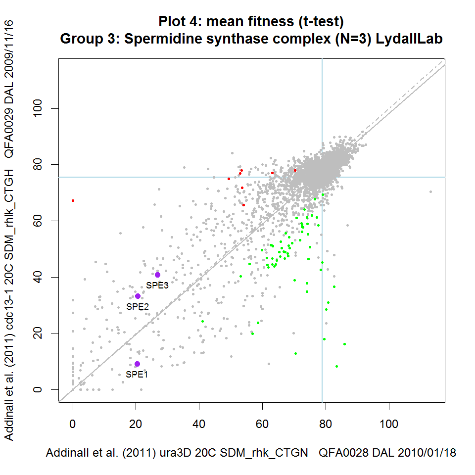
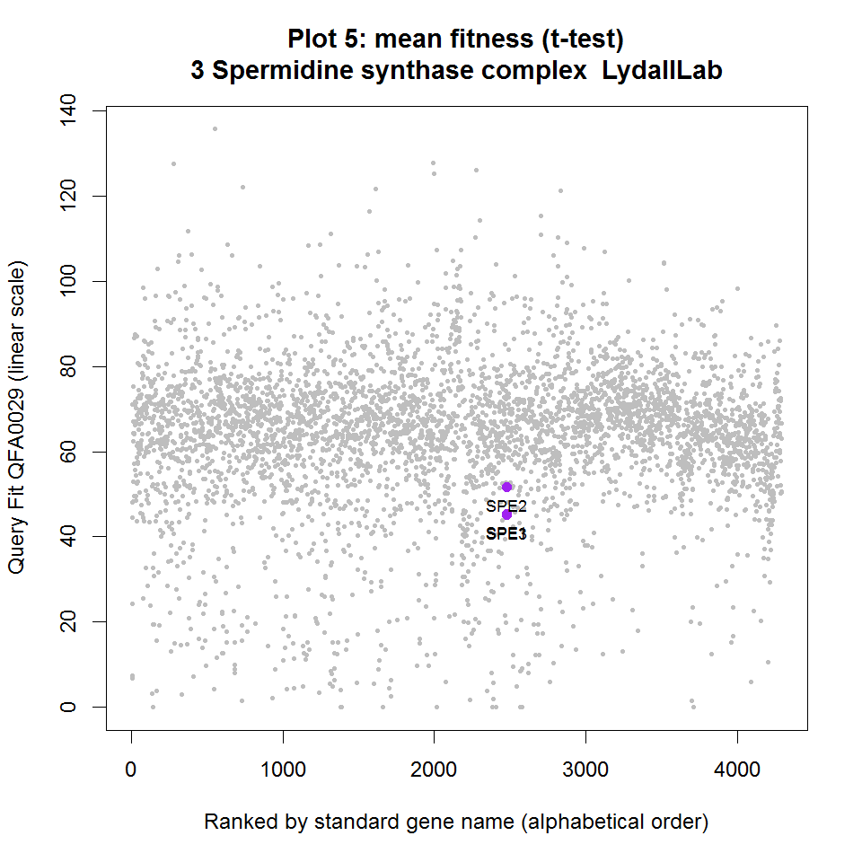

<!--
%\VignetteEngine{knitr::knitr}
%\VignetteIndexEntry{iRVis}
-->

iRVis: inteRactive Visualisation of fitness comparisons
=======================================================

You can <a href="javascript:window.print()">print</a> this document to have a physical copy to hand while using iRVis.

Introduction 
------------

By comparing the fitnesses of independent microbial strains under two different environmental or genetic conditions (e.g. query and control conditions) we can rank and compare the strength of gene-gene or gene-environment interactions.  Several technologies for measuring microbial fitness exist, including Quantitative Fitness Analysis ([QFA] [qfa]), Synthetic Genetic Array (SGA) and liquid culture growth assays.  Genome-wide fitness comparisons can become difficult to visualise by static, 2D scatterplot due to the sheer number of strains examined because simultaneous labelling of ~4,000 genes on a single plot is not practical. For example, in Figure 1, the labels for many genes are obscured.

<a href="http://www.plosgenetics.org/article/fetchObject.action?uri=info:doi/10.1371/journal.pgen.1001362.g002&representation=PNG_L"></a>

**Figure 1: A static fitness plot** Fitness plot showing evidence for gene-gene interactions between a query mutation and each of the deletions in the yeast knock-out collection.  Mean fitnesses were calculated for each deletion combined with a temperature sensitive query mutation (*yku70&Delta;*) and plotted on the y-axis.  Mean fitnesses were calculated for each deletion combined with a neutral control mutation (*ura3&Delta;*) and plotted on the x-axis.  The screens were approximately temperature matched (~37&deg;C).  Red and green points indicate genotypes which significantly suppress and enhance the fitness defect of the query mutation, respectively.  Blue horizontal and vertical lines intersect at the point corresponding to *his3&Delta;* (a wild-type surrogate). Solid grey line is predicted double-mutant fitness, given single deletion fitness and assuming a multiplicative model of genetic independence. Dashed grey line is the line of equal fitness..  This static fitness plot was generated using an early version of the QFA R package and is a reproduction of [Figure 2] [fig2] from [Addinall et al., 2011] [addinall]

[qfa]: http://research.ncl.ac.uk/qfa/ "Quantitative Fitness Analysis"
[fig2]: http://www.plosgenetics.org/article/fetchObject.action?uri=info:doi/10.1371/journal.pgen.1001362.g002&representation=PNG_M "Figure 2 from Addinall et al."
[addinall]: http://www.plosgenetics.org/doi/pgen.1001362 "Addinall et al., 2011"

iRVis is a tool for generating interactive versions of fitness plots (as shown in Figure 1).  iRVis allows us to make rapid, visual comparisons between different pairs of QFA experiments and to query plots in real time, aiding analysis and interpretation of the underlying data. iRVis can be applied to any paired sets of control and query fitnesses, including SGA data, or fitnesses derived from liquid growth curves.

We are also currently developing <a href="http://bsu-srv.ncl.ac.uk/dixy/">DIXY</a>, a web-based alternative with broadly similar functionality.  DIXY has the advantage that it requires no installation, it simply runs in your browser.  However, transitions between plots currently run much slower using the web-based tool and so, for the moment, we recommend the R-based version for browsing multiple datasets.

<a href="QFAVisualisation0001.png"></a>
<a href="QFAVisualisation0002.png"></a>
<a href="QFAVisualisation0003.png"></a>

**Figure 2: Static versions of iRVis fitness plots** Fitnesses from three telomere-related screens plotted against matched controls.  Data from Addinall et al., 2011 re-plotted using iRVis. Four functionally related genes are highlighted in purple on each plot and gene names printed. Genes highlighted in green significantly enhance the background mutation phenotype indicated in the y-axis label. Similarly, genes highlighted in red suppress the phenotype. Blue horizontal and vertical lines intersect at the point corresponding to *his3&Delta;* (a wild-type surrogate). Solid grey line is predicted double-mutant fitness, given single deletion fitness and assuming a multiplicative model of genetic independence. Dashed grey line is the line of equal fitness. Click on panels to zoom.

On each iRVis plot, the main title indicates the statistic used to summarise replicate fitness observations (e.g. mean or median) and the statistical test used to identify enhancers and suppressors (e.g. Student's t-test or the Wilcoxon test).  Similarly, some information about the genotype, environmental conditions, screen IDs and the date the screen was carried out can be found in the axis labels.  The interactive features of iRVis can be used to display more experimental metadata in real-time.

Datasets underlying fitness plots
---------------------------------

iRVis plots are generated from tab-delimited text files summarising fitnesses and genetic interaction strengths that are output by the ```report.epi``` function in the qfa package.  Here is an example data file from a comparison between a *cdc13-1* screen with a *ura3&Delta;* screen carried out at 27&deg;C by QFA, as presented by [Addinall et al., 2011] [addinall] (see Figure 2): <a href="http://qfa.r-forge.r-project.org/docs/DAL_cdc13-1_vs_ura3_27_SDM_rhlk_CTGH_GIS.txt">DAL_cdc13-1_vs_ura3_27_SDM_rhlk_CTGH_GIS.txt</a>.  iRVis generates visual representations of this tabular data, allowing us to highlight genes of interest and to rapidly observe how the fitnesses (and genetic interaction strengths) of highlighted genes change in different backgrounds.  

Starting iRVis
-----------------

First start the R application. Once R is running, type the following command at the command prompt (pressing enter after) to load the qfa package which contains iRVis:
```
library(qfa)
```

To view this documentation, we can examine the iRVis vignette, which is a tutorial document.  The vignettes available in the qfa package can be listed by executing the following command (please note that R commands are case-sensitive):
```
browseVignettes("qfa")
```

Simply click on the iRVis HTML link to access the vignette.

Now that the qfa package is loaded, there are several ways to use the visualisation tool, which will be described later.  The qfa package comes with a set of publically available datasets (from [Addinall et. al 2011] [qfa]) pre-loaded.  To quickly start interacting with these demo datasets, the simplest thing to do is to type the following at the command prompt (followed by enter):

```
iRVisDemo()
```

Each time iRVis starts, it displays some useful summaries and file locations on the console.  This information includes the following:
- The path to a tab-delimited text file (FunctionalComplexes.txt) containing a list of groups of functionally related genes available for highlighting.  This file can be edited using any text editor or spreadsheeting program.  You can add groups of genes to this list if you wish.
- The path to a tab-delimited text file (MetaReport.txt) which is a report listing all of the available metadata for each of the fitness plots currently available to iRVis.
- A summary of the experimental metadata for available datasets (this summary is displayed on the console and written to a file on your hard-drive: MetaReportSummary.txt)
- A brief summary of the mouse and keyboard commands for interacting with iRVis (more detailed instructions in the **Interacting with plots** section below).

Managing the console and the plotting window
--------------------------------------------

It is important to note that iRVis consists of two windows: the text-based console and a graphics window for displaying plots.  Upon starting iRVis, a plotting window should appear alongside the R text console and a brief summary of instructions for using the keyboard and mouse to interact with iRVis should be listed in the console window.  The user can interact with both of these windows and may need to switch back and forth between them while using iRVis. Note that you may need to click on the console window to put it into focus before you can interact with it (e.g. when typing in Gene names etc.). Similarly, you may have to click on the plotting window to put it into focus before attempting to use any keyboard plotting commands. More detailed instructions below.  

Interacting with plots
----------------------

Users can interact with plots in several ways, using the keyboard and mouse. The full set of controls are described separately below, but here is an overview of some of the functionality of iRVis.  Users can:

- Click on points in a fitness plot, highlighting them and overlaying the relevant gene names (corresponding to the relevant deletion from the yeast deletion collection, for example)
- Open a relevant online resource for the selected gene (e.g. the Saccharomyces Genome Database web-page for that gene) with the click of a button
- Quickly switch between different fitness plots (different experiments), keeping a set of genes highlighted
- Quickly switch between highlighting different sets of functionally related genes on a given fitness plot
- Manually specify a list of interesting genes for highlighting
- Quickly switch between different views of the same data, alternating between scatterplots and various types of ordered rank plots
- Print plots to file in a range of formats (including publication quality vector-graphic formats)

There are many different approaches you can take to view your fitness data with iRVis.  We suggest you explore the functionality available and discover what is most useful for you.

### Mouse interaction
- **Left click**: Add gene associated with a point on fitness plot to list of selected genes and display its standard gene name.  If the gene name is already displayed (gene already selected) left-clicking will rotate text position to help arrange text to minimise overlap.
- **Right click (alternatively, press 'w' on keyboard)**: Open a relevant online resource for gene.   For example, directs your browser to the SGD summary page for *S. cerevisae* genes.
- **Middle click (alternatively, press 'd' on keyboard)**: Remove last gene from list of selected genes.

### Keyboard interaction

#### Browsing fitness plots
- **Left/Right arrow**: Change fitness plot currently loaded.  Each fitness plot is a visualisation of the comparison between a different pair of QFA experiments.  Comparisons are stored as tab-delimited text files generated by the report.epi function in the qfa R package.  Demo comparisons from Addinall et al. 2011 are included in the qfa package itself but typically users load specific sets of data by installing separate, private R data packages (see section below).

#### Highlighting groups of genes  
- **Up/Down arrow**: Change group of functionally related genes currently highlighted (in purple).  Two sets of functionally related groups of genes are included in the qfa R package: 1) a list of manually curated, functionally related genes, including many telomere-related sets, which is loaded by default and 2) a list of GO terms and all genes co-annotated with each term which can be loaded as described in the **Highlighting other groups of genes** section below.  
- **u**: Add new, user-specified group of genes to the set of functionally related groups of genes available for highlighting.  Note that user must first have the plot window in focus when pressing 'u'.  Then, switch focus to the text console to enter gene names by following the instructions which will be printed to the console.  Once the list of gene names and a memorable label for the group have been input, the group will be highlighted on the current plot and available for highlighting on all plots which are currently loaded.  
- **z**: Toggle select tool on/off. The select tool allows the user to simultaneously select groups of neighbouring genes on the current fitness plot for highlighting by drawing a polygon on plot. Genes which are in the same area of a fitness plot are interesting because they generally share the same strength of genetic interaction with the query.  Functionally related genes are often found next to each other on fitness plots.  Turn select mode on by pressing 'z', then left-click at a series of positions surrounding the group of interest. Press 's' to highlight genes within the selected area when finished.
- **s**: Highlight genes enclosed using the select tool ('z').
- **c**: Clear highlighting from all currently selected genes (de-select currently selected genes).
- **w**: Open a relevant online resource in your browser for last gene highlighted.
- **d**: Remove highlighting from last gene highlighted (de-select last gene highlighted).

#### Highlighting significant interactions
- **t**: Toggle significance colours (red/green) indicating positive and negative interaction.  Most fitness plots include coloured points indicating genes for which there is evidence that their fitness in the query QFA experiment deviates significantly from that predicted by the multiplicative model for genetic independence.  By default, positive interactions (enhancers) are coloured green and negative interactions (suppressors) are coloured red.

#### Switching between plot styles
- **l**: Toggle plot style between fitness plot (as presented in Addinall et al., 2011) and rank plot.  Instead of just examining a scatter plot comparing query and control fitness summaries, we can examine the ratio of query to control fitness ranked by gene name for example and look for interesting outliers on this view instead.  See the **Different views of the data** section below.
- **i**: Toggle between ratio plot styles.  After toggling from scatterplot view to ratio view (by pressing 'l'), there are several different options available for sorting or ranking the points.  By repeatedly pressing 'i' once in ratio mode, the user can toggle between ranking genes as follows: alphabetically by standard gene name, alphabetically by systematic gene name (typically related to chromosome coordinate), numerically by fitness ratio, numerically by control fitness and numerically by query fitness.  
- **k**: Toggle between variables displayed on y-axis in ratio plot mode.  By repeatedly pressing 'k' once in ratio mode, the user can toggle between displaying the following variables on the y-axis as follows: log of query to control fitness ratio, query fitness alone, control fitness alone.

#### Saving plots to file 
- **p,n,m:** Save current plot to image file.  'p': saves plot as a vector graphic postscript file to QFAVisualisation.ps, suitable for editing in a vector graphics editor (such as Inkscape or Adobe Illustrator) 'n': saves plot in a lossless raster file format .png 'm': saves plot as a vector graphic .pdf format, suitable for immediate viewing with a PDF viewer such as Adobe Reader.  Note that the location of the new image file will be printed to console once the file is written.

#### Experimental metadata & selected genes
- **b**: Print experimental metadata report to console window.  There is a limited amount of information that can be represented on the axes labels of fitness plots.  Considerably more experimental metadata is contained in the tab-delimited text files from which the plots are generated.  Pressing 'b' while examining any view of a fitness plot allows the user to see all of the experimental metadata for that pair of QFA experiments.  A full listing of the metadata for all experiment pairs currently loaded is written to file, together with a separate, summary file to help users quickly browse datasets are written to the hard drive when the tool starts up.  File location for metadata and summary reports are also printed to the console when the tool starts.
- **v**: Print the systematic and standard names of selected genes to console and also copy a list of standard gene names to the clipboard.  Printing selected gene names to the console can be useful when users wish to preserve an interesting group of highlighted genes for visualisation in a later session.  Gene names can be stored in a separate text file ready to be copied and pasted back into iRVis at a later date.
- **x**: Print the systematic and standard names of selected genes to console and also copy a list of systematic gene names to the clipboard.  Printing selected gene names to the console can be useful when users wish to preserve an interesting group of highlighted genes for visualisation in a later session.  Systematic gene names can be input into other bioinformatics tools for further analysis.

#### Quitting iRVis
- **q**: Quit iRVis and print gene names currently selected to console window.  

Different views of the data (press 'l')
---------------------------------------
Pressing 'l' toggles between the standard view of QFA data: the fitness scatterplot and alternative rank plot views.  In rank plots we plot various measures of interaction or fitness against some ranking of the genes on the x-axis.  There are several different options available for sorting or ranking the points.  

By repeatedly pressing 'i' in rank mode, the user can toggle between ranking genes as follows:
- Ranked alphabetically by standard gene name
- Ranked alphabetically by systematic gene name (typically related to chromosome coordinate)
- Ranked numerically by fitness ratio
- numerically by control fitness
- numerically by query fitness

By repeatedly pressing 'k' in rank mode, the user can toggle between y-axis variables as follows:
- Query/control fitness ratio (log scale)
- Strength of genetic interaction (GIS) between query and array gene
- Query fitness (linear scale)
- Control fitness (linear scale)

The current ranking is listed in the x-axis label of rank plots.

<a href="RatioPlot0001.png"></a>
<a href="RatioPlot0002.png"></a>
<a href="RatioPlot0002.png"></a>
<a href="RatioPlot0003.png"></a>
<a href="RatioPlot0004.png"></a>
<a href="RatioPlot0005.png"></a>
<a href="RatioPlot0006.png"></a>
<a href="RatioPlot0005.png"></a>
<a href="RatioPlot0006.png"></a>

**Figure 3: Static versions of nine different iRVis views of a single dataset**  Fitness plot and eight (of a possible 20) rank plots of the *cdc13-1* vs. *ura3&Delta;* experiment presented in panel A of Figure 2.

Highlighting other groups of genes
----------------------------------

Three default lists of functionally related gene complexes are presented within the qfa package:
 
1.	**buildComplexes**  A list of about 500 related groups of *S. cerevisiae* genes including telomere-related genes that are of interest to the Lydall lab together with hits from telomere-length screens by Askree et al. (2004) & Meng et al. (2009), replicative senescence screens by Chang et al.(2010), a chromosome instability screen by Stirling et al. (2011) and a manually curated list of functionally related complexes by Benschop et al. (2010) 
2.	**buildGO**  A list of all *S. cerevisiae* genes that are co-annotated with each of about 4,000 GO terms from [SGD](http://www.yeastgenome.org/).
3.  **buildPombeGO**  A list of all *S. pombe* genes that are co-annotated with each of about 400 GO terms from the [pombase](http://www.pombase.org/) database. 

Executing ```iRVisDemo(buildComplexes)``` allows highlighting of groups of genes from list 1 above. We imagine that this list will be the most useful for users and so we have allowed the following shorthand for starting iRVis with this list loaded (please note that R commands are case-sensitive):
```
iRVisDemo()
```

If you would like to use a version of iRVis with genes co-annotated by specific GO terms highlighted instead (list 2), first quit iRVis (by pressing 'q') and type the following command in the text console (followed by enter):
```
iRVisDemo(buildGO)
```

Similarly, if you would like to highlight genes co-annotated with GO terms in a *S. pombe* dataset, you can use the following command:
```
iRVisDemo(buildPombeGO)
```

Note that there are about 4,000 GO terms to browse through in *S. cerevisiae* datasets...

Loading other datasets
----------------------
You might receive different datasets in the form of R packages from the Newcastle University High-Throughput Service or from the Lydall lab.  We find that grouping QFA experimental results together in separate, data-only R packages is a useful way to distribute datasets separately and privately.  In order to browse the QFA data within a data-only R package, you will need to install the data package (in addition to the qfa package you have already installed).  For example, you may receive a package file named ```qfaDAL_0.0-9.zip``` (Windows) or ```qfaDAL_0.0-9.zip``` (OSX and Linux). Some installation instructions for Microsoft Windows and OSX users can be found [here] [install].

[install]: http://outmodedbonsai.sourceforge.net/InstallingLocalRPackages.html "Installing R packages"

Once the data package is installed, you will need to load it.  By loading the data package, R will automatically load the qfa package (and therefore iRVis).  In order to load the data package, note its name: the part of the package filename before the underscore: ```qfaDAL``` in the example above.  To load a package named ```qfaDAL```, start the R application and type the following into the terminal, followed by enter (please note that R commands are case-sensitive):

```
library(qfaDAL)
```

Once the data package is loaded you can launch iRVis as follows:

```
visAll()
```
As we did for ```iRVisDemo()```, we can load an alternative list of groups of genes co-annotated with one of 4,000 different GO terms:
```
visAll(buildGO)
```

The demo datasets from Addinall et al. 2011, included in the qfa package, will always be present for comparison.

You can <a href="javascript:window.print()">print</a> this document to have a physical copy to hand while using iRVis.