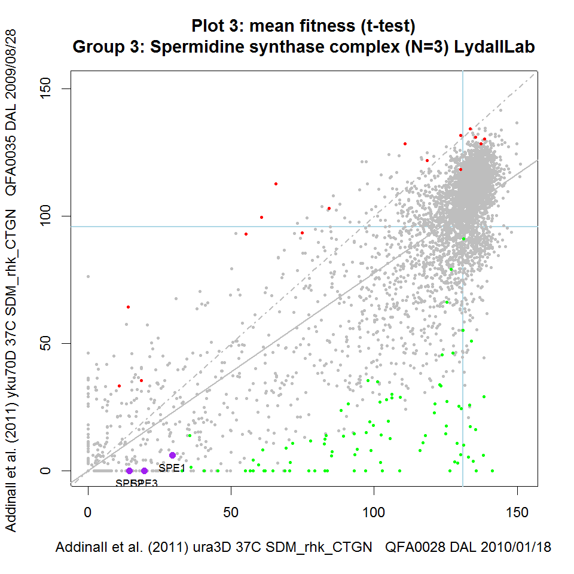
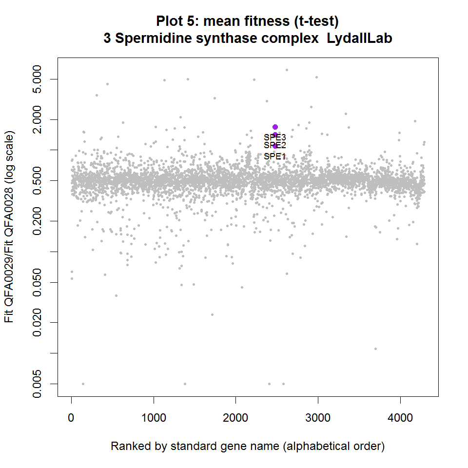
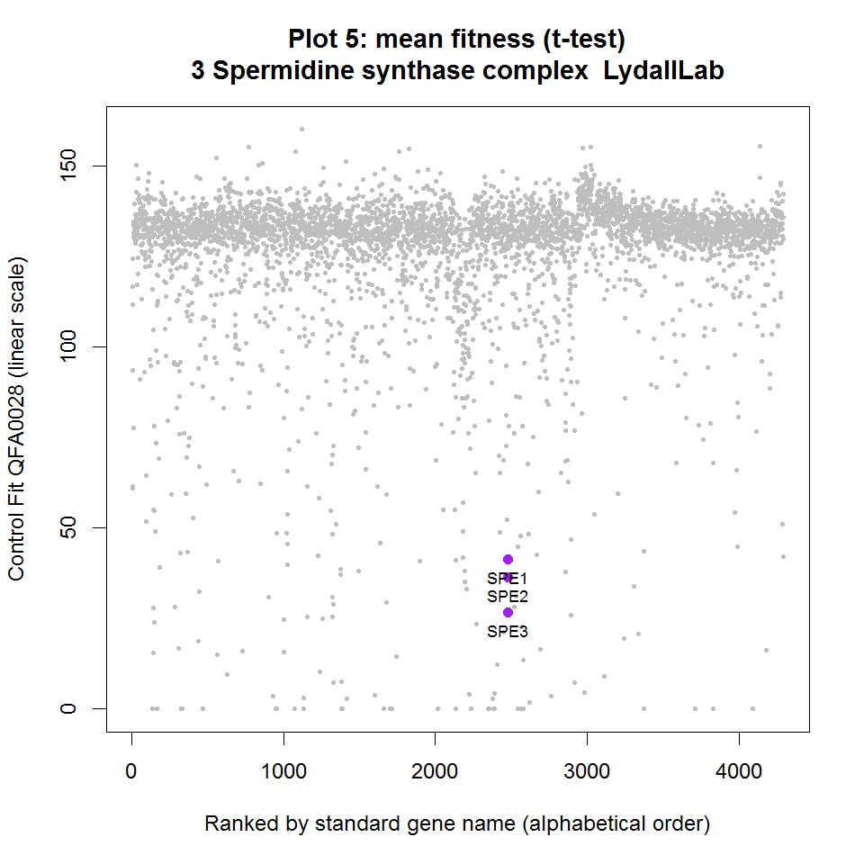
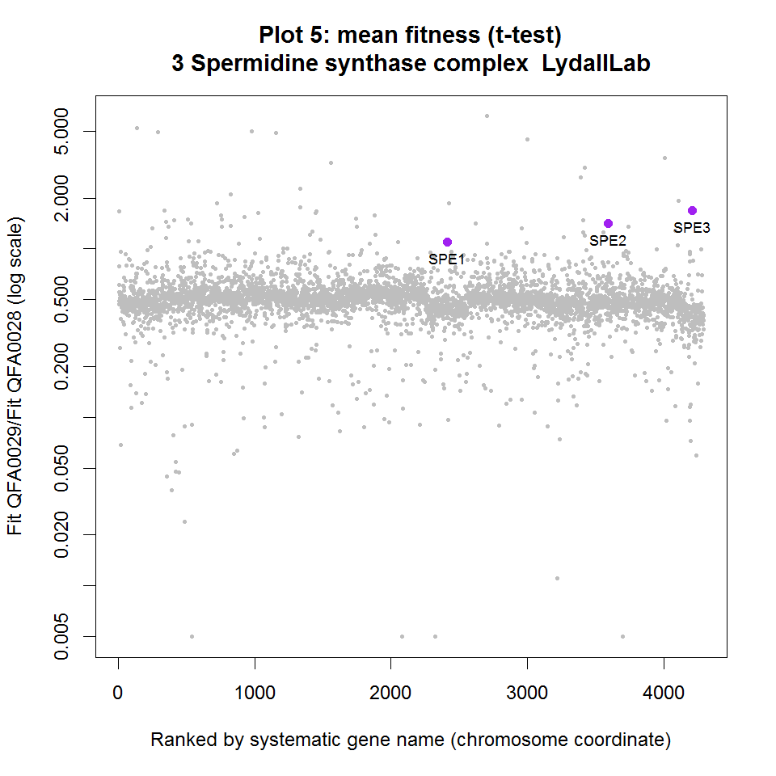

<!--
%\VignetteEngine{knitr::knitr}
%\VignetteIndexEntry{visTool}
-->

Introduction 
------------------------------------------------
[QFA] [qfa] experiments are often used to compare the fitnesses of independent microbial strains under two different environmental conditions (e.g. query and control conditions), or in two different genetic backgrounds, to search for evidence for drug interactions or genetic interactions for example. Such comparisons can become difficult to visualise by static scatterplot due to the sheer number of strains examined, simply because simultaneous labelling of ~4,000 genes on a single plot is not practical. For example, in [Figure 2] [fig2] from [Addinall et al., 2011] [addinall] the labels for many genes in interesting locations, suggesting genetic interaction with *yku70&Delta;*, are obscured:

<a href="http://www.plosgenetics.org/article/fetchObject.action?uri=info:doi/10.1371/journal.pgen.1001362.g002&representation=PNG_M"></a>

[qfa]: http://research.ncl.ac.uk/qfa/ "Quantiative Fitness Analysis"
[fig2]: http://www.plosgenetics.org/article/fetchObject.action?uri=info:doi/10.1371/journal.pgen.1001362.g002&representation=PNG_M "Figure 2 from Addinall et al."
[addinall]: http://www.plosgenetics.org/doi/pgen.1001362 "Addinall et al., 2011"

Interactive versions of fitness plots such as this can be generated by the visualisation tool in the qfa R package.  Data summarising fitnesses and genetic interaction strengths are output from the ```report.epi``` function in the qfa package in the form of tab-delimited text files which can be read as spreadsheets.  Here is an example corresponding to the *cdc13-1* experiment carried out at 27&deg;C (see plot below): [DAL_cdc13-1_vs_ura3_27 SDM_rhlk_CTGH_GIS.txt] [gis].  The visualisation tool generates visual representations of this tabular data, allowing us to highlight genes of interest and rapidly observe how the fitnesses (and genetic interaction strengths) of highlighted genes change in different backgrounds.  

[gis]: DAL_cdc13-1_vs_ura3_27_SDM_rhlk_CTGH_GIS.txt "Fitness summaries and genetic interaction strength estimates"

The qfaR visualisation tool provides a means to interact with such scatterplots, to make rapid, visual comparisons between different pairs of QFA experiments and to query plots in real time, aiding analysis and interpretation of the underlying data. qfaR visualisation can be applied to any paired sets of control and query fitnesses, including SGA screen data, or fitnesses derived from liquid growth curves, for example.

<a href="QFAVisualisation0001.png"></a>
<a href="QFAVisualisation0002.png"></a>
<a href="QFAVisualisation0003.png"></a>

**qfaR Fitness Plots** Scatterplots of data from Addinall et al., 2011 printed using the qfaR visualisation tool. The same four functionally related genes are highlighted in purple on each plot and names printed. Genes highlighted in green significantly enhance the background mutation phenotype indicated in the y-axis label. Similarly, genes highlighted in red suppress the phenotype. Blue horizontal and vertical lines intersect at the point corresponding to *his3&Delta;* (a wild-type surrogate). Solid grey line is predicted double-mutant fitness, given single deletion fitness and assuming a multiplicative model of genetic independence. Dashed grey line is the line of equal fitness. Click on panels to zoom.

Screen pairs are indicated with shorthand labels on the x and y axis. For example, the label 'Addinall et al. (2011) cdc13-1 27C' represents an experiment combining the yeast deletion collection with a background *cdc13-1* mutation, grown at 27&deg;C. For each QFA pair, the plot title indicates the statistic used to summarise replicate fitness observations (e.g. mean or median) and the statistical test used to identify enhancers and suppressors (e.g. Student's t-test or the Wilcoxon test).  However, there is only so much metadata that can be stored in the labels of a scatterplot.  Users can use the interactive features of the visualisation tool to display in real-time more metadata describing a given pair of experiments.

Starting the tool
------------------------------------------------

First start the R application. Once R is running, type the following command at the command prompt (pressing enter after) to load the qfa package which the visualisation tool is a part of:
```
library(qfa)
```

To view this documentation, we can examine the visualisation tool vignette:
```
vignette(visTool)
```

Now that the qfa package is loaded, there are several ways that we can use the visualisation tool, some of which will be described later.  The tool comes with a set of publically available datasets (from [Addinall et. al 2011] [qfa]) pre-loaded, so that we can quickly and easily try it out.  To load these demo datasets, the simplest thing to do is to type the following at the command prompt (followed by enter):

```
visToolDemo(buildComplexes)
```

Managing the console and the plotting window
------------------------------------------------

A plotting window should appear alongside the R text console, and a brief summary of instructions for using the keyboard and mouse to interact with the data should be printed to the console.  More detailed instructions can be found below.  It is important to note that the visualisation tool consists of two windows: the text-based console and a graphics window for displaying plots.  The user can interact with both of these windows and may need to switch back and forth between them while using the tool. Note that you may need to click on the console window to put it into focus before you can interact with it (e.g. when typing in Gene names etc.). Similarly, you may have to click on the plotting window to put it into focus before attempting to use any keyboard plotting commands.

Interacting with plots
------------------------------------------------

Users can interact with plots in several ways, using the keyboard and mouse. The full set of controls are described separately below. Briefly, clicking on points highlights them and overlays the relevant gene names (corresponding to the relevant deletion from the yeast deletion collection, for example) onto the scatterplot. Right-clicking on a point, or pressing the 'w' key for users without a second mouse button, opens a relevant online resource for the selected gene (e.g. the Saccharomyces Genome Database web-page for that gene). The user can browse through different fitness plots, while keeping the same genes highlighted, by pressing the left and right arrow keys. The user can browse different functionally related groups of genes, by using the up and down arrow keys. Two default lists are presented within the QFA package itself: 1) A list of about 500 genes including telomere-related genes that are of interest to the Lydall lab together with hits from telomere-length screens by Askree et al. (2004) & Meng et al. (2009), replicative senescence screens by Chang et al.(2010), a chromosome instability screen by Stirling et al. (2011) and a manually curated list of functionally related complexes by Benschop et al. (2010) 2) A list of all genes co-annotated with about 4,000 GO terms from the gene ontology database. Users can search for groups of their favourite genes by pressing 'u' and following instructions in the R console.  Following this procedure is effectively a manual way to append a list of genes to the current list of functional groups for the duration of the visualisation tool session. The user can also examine different views of the same data (with the same genes highlighted) by toggling between QFA fitness plots (as presented in Addinall et al., 2011) and query/control fitness ratio plots by pressing 'l'.  Drawing ratio plots requires choosing a gene order (e.g. order alphabetically by name or order by fitness ratio itself) and the user can toggle between various ordering options by pressing 'i'. Finally, users can output plots to publication quality PDF figures after highlighting genes of interest by pressing 'p'.

__Mouse__
- **Left click**: Add gene associated with a point on fitness plot to list of selected genes and display its standard gene name.  If the gene name is already displayed (gene already selected) left-clicking will rotate text position to help arrange text to minimise overlap.
- **Right click (alternatively, press 'w' on keyboard)**: Open a relevant online resource for gene.   For example, directs your browser to the SGD summary page for *S. cerevisae* genes.
- **Middle click (alternatively, press 'd' on keyboard)**: Remove last gene from list of selected genes.

__Keyboard__
- **Left/Right arrow**: Change fitness plot currently loaded.  Each fitness plot is a visualisation of the comparison between a different pair of QFA experiments.  Comparisons are stored as tab-delimited text files generated by the report.epi function in the qfa R package.  Demo comparisons from Addinall et al. 2011 are included in the qfa package itself but typically users load specific sets of data by installing separate, private R data packages (see section below).  
- **Up/Down arrow**: Change group of functionally related genes currently highlighted (in purple).  Two sets of functionally related groups of genes are included in the qfa R package: 1) a list of manually curated, functionally related genes, including many telomere-related sets, which is loaded by default and 2) a list of GO terms and all genes co-annotated with each term which can be loaded as described below.  
- **u**: Add new, user-specified group of genes to the set of functionally related groups of genes available for highlighting.  Note that user must first have the plot window in focus when pressing 'u'.  Then, switch focus to the text console to enter gene names by following the instructions which will be printed to the console.  Once the list of gene names and a memorable label for the group have been input, the group will be highlighted on the current plot and available for highlighting on all plots which are currently loaded.  
- **z**: Toggle select tool on/off. The select tool allows the user to simultaneously select groups of neighbouring genes on the current fitness plot for highlighting by drawing a polygon on plot. Genes which are in the same area of a fitness plot are interesting because they generally share the same strength of genetic interaction with the query.  Functionally related genes are often found next to each other on fitness plots.  Turn select mode on by pressing 'z', then left-click at a series of positions surrounding the group of interest. Press 's' to highlight genes within the selected area when finished.
- **s**: Highlight genes enclosed using the select tool ('z').
- **c**: Clear highlighting from all currently selected genes (de-select currently selected genes).
- **w**: Open a relevant online resource in your browser for last gene highlighted.
- **d**: Remove highlighting from last gene highlighted (de-select last gene highlighted).
- **t**: Toggle significance colours (red/green) indicating positive and negative interaction.  Most fitness plots include coloured points indicating genes for which there is evidence that their fitness in the query QFA experiment deviates significantly from that predicted by the multiplicative model for genetic independence.  By default, positive interactions (enhancers) are coloured green and negative interactions (suppressors) are coloured red.
- **l**: Toggle plot style between fitness plot and ratio plot.  Instead of just examining a scatter plot comparing query and control fitness summaries, we can examine the ratio of query to control fitness ranked by gene name for example and look for interesting outliers on this view instead.
- **i**: Toggle between log ratio plot styles.  After toggling from scatterplot view to ratio view (by pressing 'l'), there are several different options available for sorting or ranking the points.  By repeatedly pressing 'i' once in ratio mode, the user can toggle between ranking genes as follows: alphabetically by standard gene name, alphabetically by systematic gene name (typically related to chromosome coordinate), numerically by fitness ratio, numerically by control fitness and numerically by query fitness.   
- **p,n,m:** Save current plot to image file.  'p': saves plot as a vector graphic postscript file to QFAVisualisation.ps, suitable for editing in a vector graphics editor (such as Inkscape or Adobe Illustrator) 'n': saves plot in a lossless raster file format .png 'm': saves plot as a vector graphic .pdf format, suitable for immediate viewing with a PDF viewer such as Adobe Reader.  Note that the location of the new image file will be printed to console once the file is written.
- **b**: Print experimental metadata report to console window.  There is a limited amount of information that can be represented on the axes labels of fitness plots.  Considerably more experimental metadata is contained in the tab-delimited text files from which the plots are generated.  Pressing 'b' while examining any view of a fitness plot allows the user to see all of the experimental metadata for that pair of QFA experiments.  A full listing of the metadata for all experiment pairs currently loaded is written to file, together with a separate, summary file to help users quickly browse datasets are written to the hard drive when the tool starts up.  File location for metadata and summary reports are also printed to the console when the tool starts.
- **q**: Quit tool and print gene names currently selected to console window.  Printing selected gene names to the console can be useful when users wish to preserve an interesting group of highlighted genes for visualisation in a later session.  Gene names can be stored in a separate text file ready to be copied and pasted back into the tool at a later date.

Different views of the data
----------------------------------------
Pressing 'l' toggles between fitness scatterplot and ratio plot views of the data.  Ratio plots are a different kind of scatterplot where the ratio of query fitness to control fitness (on a log scale) is shown on the y-axis, and some ranking of the genes on the x-axis.  There are several different options available for sorting or ranking the points.  By repeatedly pressing 'i' once in ratio mode, the user can toggle between ranking genes as follows: alphabetically by standard gene name, alphabetically by systematic gene name (typically related to chromosome coordinate), numerically by fitness ratio, numerically by control fitness and numerically by query fitness.

Here is the fitness plots for *cdc13-1* mutations, grown at 27&deg;C again, alongside the various ratio plots that the visualisation tool can generate.

<a href="RatioPlot0001.png"></a>
<a href="RatioPlot0002.png"></a>
<a href="RatioPlot0003.png"></a>
<a href="RatioPlot0004.png"></a>
<a href="RatioPlot0005.png"></a>
<a href="RatioPlot0006.png"></a>

Highlighting other groups of genes
----------------------------------------

Executing ```visToolDemo(buildComplexes)``` allows highlighting of groups of a list of manually curated, functionally related genes, including many telomere-related sets. We imagine that this list will be the most useful for users and so we have allowed the following shorthand for starting the visualisation tool with this list loaded:
```
visToolDemo()
```

If you would like to use a version of the tool with genes co-annotated by specific GO terms highlighted instead, quit the visualisation tool (preferablty by pressing 'q' on the keyboard, rather than clicking on the 'x' button) and type the following command in the text console (followed by enter):
```
visToolDemo(buildGO)
```
However, note that there are about 4,000 GO terms to browse through...


Loading other datasets
---------------------------
You might receive different R packages from the Newcastle University High-Throughput Service or from the Lydall lab.  Grouping QFA experimental results together in separate, data-only R packages is a useful way to distribute datasets separately and privately.  In order to browse the QFA data within a data-only R package, you will need to install the data package (in addition to the qfa package you have already installed).  For example, you may receive a package file named ```qfaDAL_0.0-9.zip``` (Windows) or ```qfaDAL_0.0-9.zip``` (OSX and Linux). Some installation instructions for Microsoft Windows and OSX users can be found [here] [install].

[install]: http://outmodedbonsai.sourceforge.net/InstallingLocalRPackages.html "Installing R packages"

Once the data package is installed, you will need to load it.  It will automatically load the qfa package and the visualisation tool.  To load the data package, note the package name: the part of the filename before the underscore: ```qfaDAL``` in the example above.  Start the R application and type the following into the terminal, followed by enter:

```
library(qfaDAL)
```

Once the data package is loaded you can launch the visualisation tool as follows:

```
visAll(buildComplexes)
```
The above command loads the qfa package and appends the data from the qfaDAL package, loading a list of sets of functionally related genes for rapid highlighting.  Alternatively, we can achieve the same effect by using the following shorthand:
```
visAll()
```
Again, we can load an alternative list of genes for highlighting: sets of genes co-annotated with one of 4,000 different GO terms:
```
visAll(buildGO)
```

The demo datasets from Addinall et al. 2011, included in the qfa package, will always be present for comparison.

You can <a href="javascript:window.print()">print</a> this document to have a physical copy to hand while using the qfaR visualisation tool.

